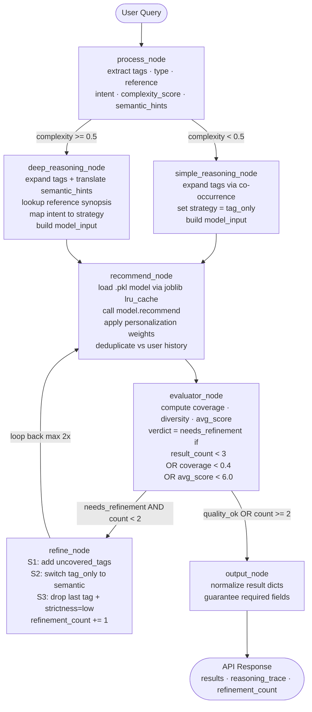
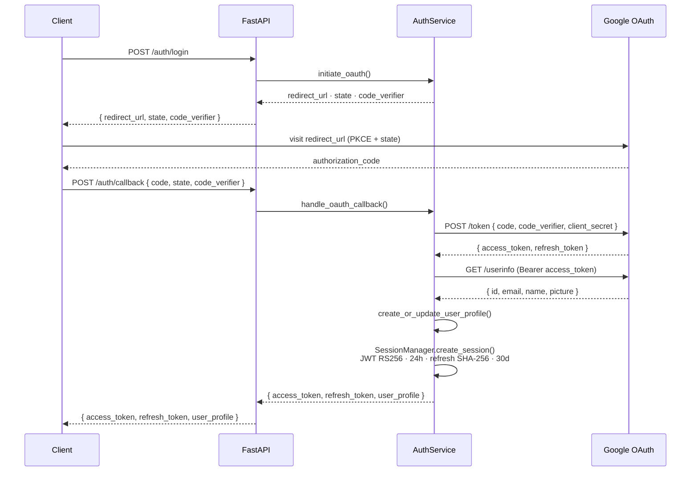
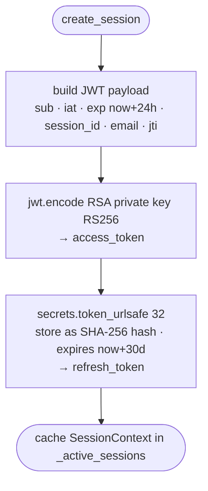
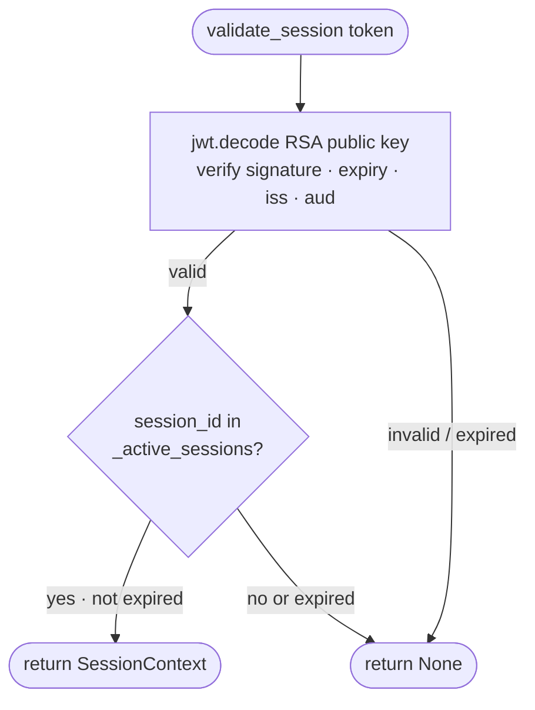
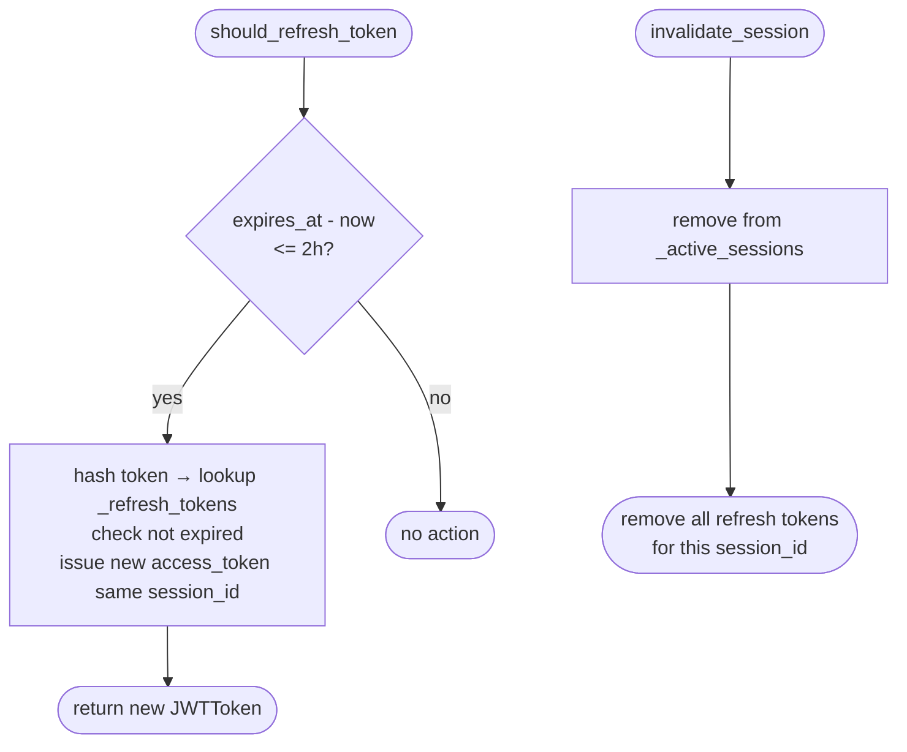
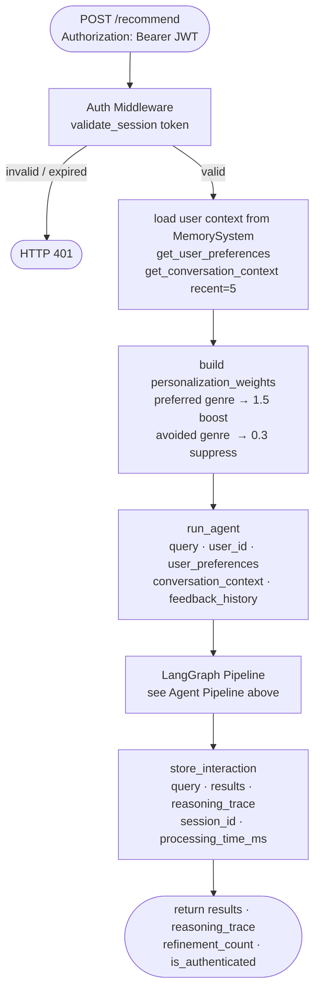
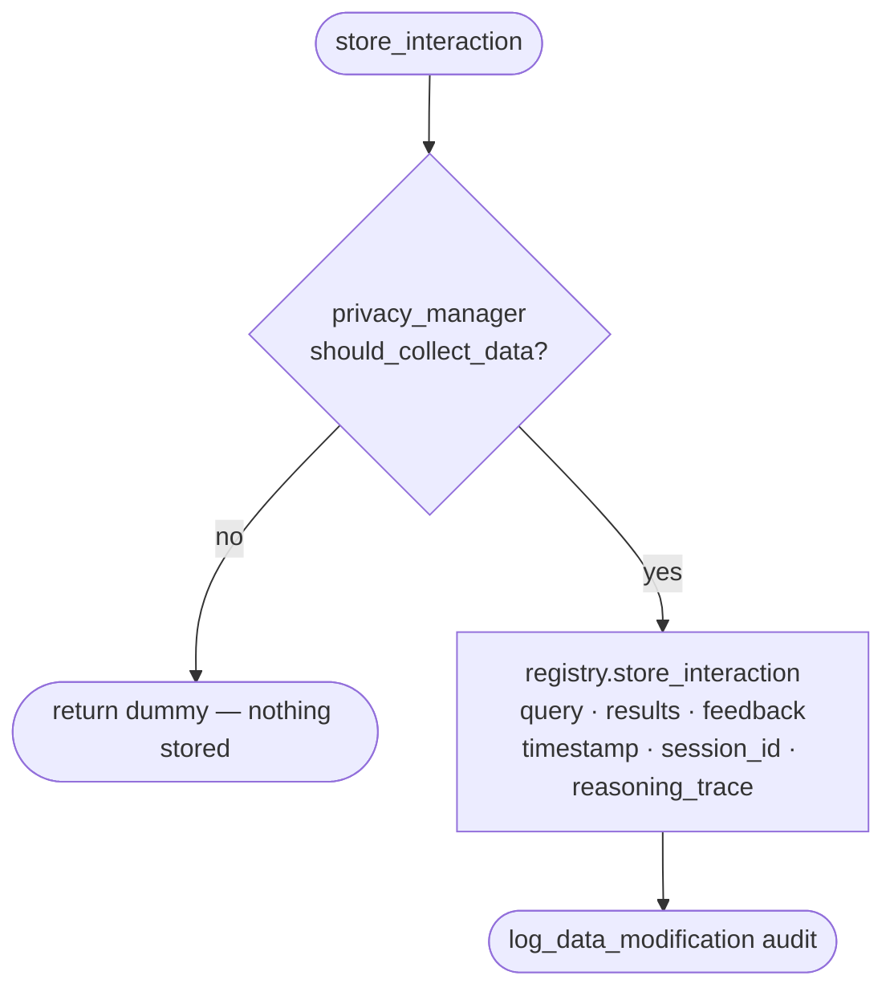
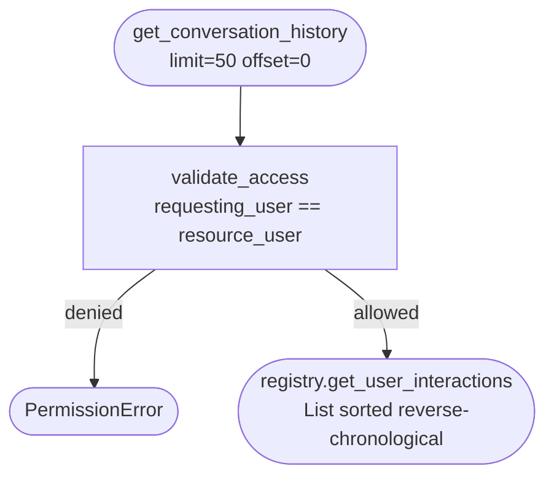
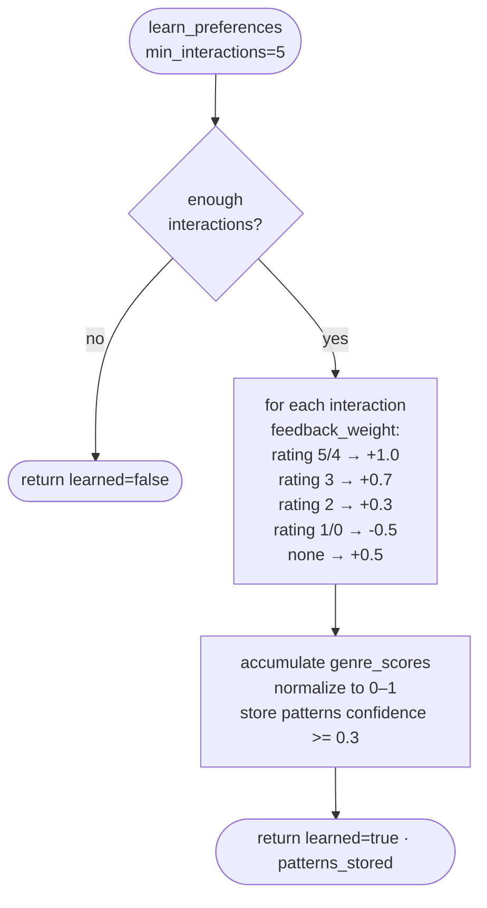
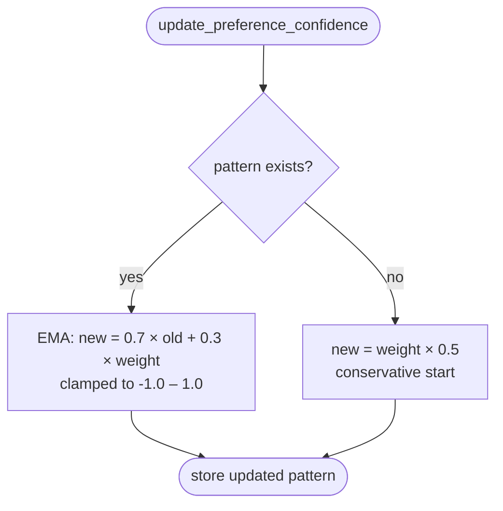

# Anime & Manga Recommendation Agent

A LangGraph-powered recommendation system with Google OAuth 2.0 authentication, per-user memory, and a self-refining 7-node pipeline.

**Stack:** FastAPI · LangGraph · Google OAuth 2.0 · JWT (RS256) · Hypothesis (property-based testing)

---

## Agent Pipeline



**Routing rules:**
- `route_query` — `complexity_score >= 0.5` → deep reasoning, else simple
- `route_evaluation` — `verdict == "needs_refinement" AND refinement_count < 2` → refine loop, else output

**Refinement strategies** (applied in order inside `refine_node`):
| Strategy | Trigger | Action |
|---|---|---|
| S1 — low coverage | `uncovered_tags` non-empty | add uncovered tags back |
| S2 — low score | `avg_score < 6.0` AND strategy is `tag_only` | switch to `semantic` |
| S3 — second cycle | `refinement_count == 1` | drop last tag, set `strictness = "low"` |

---

## Authentication Flow



### JWT Token Lifecycle

**Create Session**


**Validate Session**


**Refresh & Invalidate**


---

## Authenticated Request Flow



---

## Memory & Preference Learning

**Store Interaction**


**Get Conversation History**


**Learn Preferences**


**Update Preference Confidence**


---

## Project Structure

```
backend/
├── main.py                    # FastAPI app + all endpoints
├── agent/
│   ├── graph.py               # LangGraph pipeline, route_query(), route_evaluation()
│   ├── state.py               # AgentState TypedDict (19 fields) + initial_state()
│   └── nodes/
│       ├── process.py         # extract tags, type, reference, intent, complexity, hints
│       ├── reasoning.py       # simple + deep reasoning, tag expansion, hint translation
│       ├── recommend.py       # load .pkl model, personalization weights, deduplication
│       ├── evaluator.py       # coverage, diversity, avg_score, verdict
│       ├── refine.py          # 3 refinement strategies, rebuild model_input
│       └── output.py          # normalize results to response schema
├── services/
│   ├── authentication.py      # OAuth 2.0 flow, PKCE, user profile management
│   ├── session_manager.py     # JWT RS256 create/validate/refresh/invalidate
│   ├── memory_system.py       # conversation history, preference learning, EMA updates
│   ├── privacy_manager.py     # retention policies, audit logs, GDPR access control
│   ├── user_memory_store.py   # in-memory user registry (UserMemoryRegistry)
│   ├── query_parser.py        # 6 extraction functions for process_node
│   ├── tag_mapper.py          # co-occurrence tag expansion + _HINT_TO_TAGS
│   └── quality_evaluator.py   # evaluate_results() → coverage/diversity/verdict
├── utils/helpers.py           # deduplicate(), normalize_result(), safe_get()
└── tests/                     # unit + integration + property-based (Hypothesis)
data/
├── anime_recommender.pkl      # gitignored — joblib model
├── manga_recommender.pkl
├── refined_anime_dataset.json # used for co-occurrence index + synopsis lookup
└── refined_manga_dataset.json
```

---

## API Endpoints

| Method | Path | Auth | Description |
|--------|------|------|-------------|
| `POST` | `/recommend` | optional | Run agent pipeline, returns results + reasoning_trace |
| `GET` | `/health` | — | Liveness check |
| `POST` | `/auth/login` | — | Start OAuth, returns redirect_url + state + code_verifier |
| `POST` | `/auth/callback` | — | Exchange code for JWT + refresh token |
| `POST` | `/auth/logout` | ✅ | Invalidate session |
| `GET` | `/user/profile` | ✅ | Get user profile |
| `PUT` | `/user/preferences` | ✅ | Update preferences |
| `GET` | `/user/history` | ✅ | Paginated conversation history (50/page) |
| `DELETE` | `/user/account` | ✅ | Schedule full data deletion |

---

## Setup

```bash
python -m venv venv && source venv/bin/activate   # Windows: venv\Scripts\activate
pip install -r requirements.txt
cp .env.example .env   # fill in values below
uvicorn backend.main:app --reload
# Docs → http://localhost:8000/docs
```

Required `.env`:

```
GOOGLE_CLIENT_ID=your-client-id.apps.googleusercontent.com
GOOGLE_CLIENT_SECRET=your-client-secret
REDIRECT_URI=http://localhost:8000/auth/callback
JWT_SECRET_KEY=your-secret-key
```

```bash
pytest backend/tests/ -v   # run full test suite
```

---

## Model Contract

Models must be joblib-serialized with `recommend(dict) -> list[dict]`.

Input keys: `tags`, `type`, `reference`, `intent`, `semantic_hints`, `search_strategy`, `reference_synopsis`, `complexity`, `is_authenticated`, `user_preferences`, `conversation_context` (+ optional `strictness` on 2nd refinement cycle).

Each result dict must have: `title`, `image`, `synopsis`, `score`, `genres`. Optional: `similarity_score`, `match_reason`.
